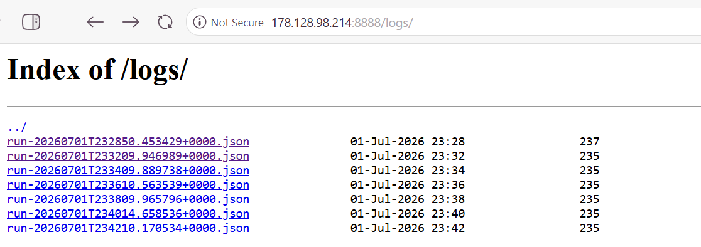
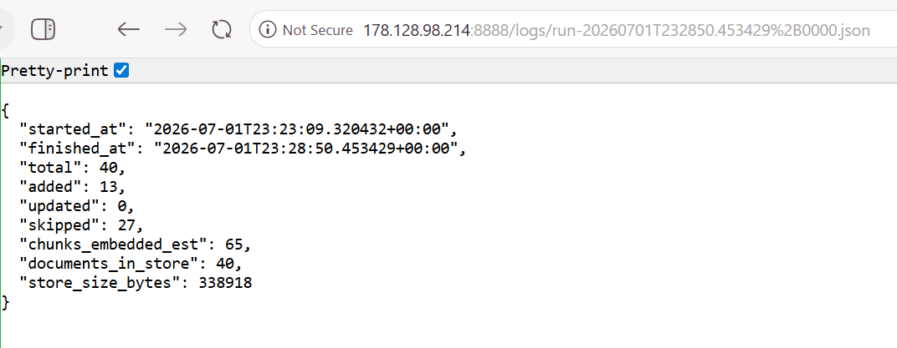
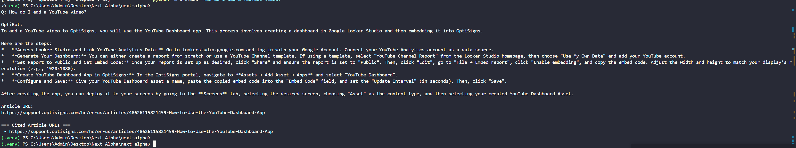
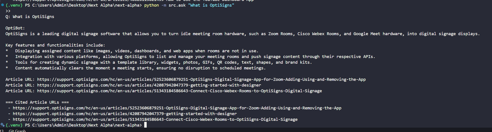

# OptiBot Mini-Clone

Customer-support chatbot that ingests OptiSigns support articles, normalizes them
to Markdown, and serves them through an AI assistant backed by **Gemini's File
Search Store** (Gemini's equivalent of an OpenAI Vector Store). A daily job
re-scrapes and uploads only what changed.

**Stack:** Python · Gemini File Search API (`google-genai`) · Docker · DigitalOcean droplet (cron).

## Architecture

```
main.py            Daily job orchestrator (scrape -> delta -> upload), runs once & exits 0
src/scraper.py     Part 1: Zendesk API -> clean Markdown (<slug>-<id>.md)
src/uploader.py    Part 2: create/reuse Gemini File Search Store, upload via API
src/delta.py       Hash-based add/update/skip detection (state read from the store itself)
src/config.py      Env-based config (no hard-coded keys)
data/articles/     Generated .md files
logs/              Per-run JSON artefacts (added/updated/skipped/chunks)
```

## Setup

```bash
python -m venv .venv && source .venv/bin/activate   # Windows: .venv\Scripts\activate
pip install -r requirements.txt
cp .env.sample .env        # then fill in API_KEY (and FILE_SEARCH_STORE_NAME after first run)
```

## Run locally

```bash
python -m src.scraper      # Part 1 only: scrape -> data/articles/*.md
python -m src.uploader     # Part 2 only: upload to vector store
python main.py             # Part 3: full daily job (scrape + delta + upload)
```

## Run with Docker

```bash
docker build -t optibot .

# Fill .env first (cp .env.sample .env). Secrets are passed at runtime, never
# baked into the image. Runs once and exits 0. Works as-is on PowerShell/bash/Linux/mac.
docker run --rm --env-file .env optibot

# ...or pass secrets inline instead of a file:
docker run --rm -e API_KEY=... -e FILE_SEARCH_STORE_NAME=... optibot
```

To also keep each run's JSON artefact on the host, add a volume mount — this is the
one place the path syntax differs per shell:

```bash
docker run --rm --env-file .env -v "$(pwd)/logs:/app/logs" optibot     # bash / Linux / macOS
docker run --rm --env-file .env -v "${PWD}/logs:/app/logs" optibot     # PowerShell (Windows)
```

## Chunking strategy

Article bodies are short support docs, so each chunk is capped at **500 tokens**
with **100 tokens of overlap** (`white_space_config`; Gemini caps a chunk at 512).
The overlap keeps each chunk self-contained — a step-by-step list won't be split
mid-way — without inflating the embedding count. Chunks advance by the stride
(500 − 100 = 400 tokens), so the last chunk holds only the leftover and is usually
shorter than the cap.

**Files vs chunks in the logs.** Each run logs the **exact** file count plus the
store's **API-reported** document count and byte size (`documents_in_store`,
`store_size_bytes`) as provider-sourced ground truth. The chunk count is logged as
an **estimate** (`chunks_embedded_est`): Gemini's File Search API does not expose
the actual per-document chunk count (a `Document` returns only `size_bytes`/`state`),
so an exact provider chunk number isn't available — it's derived from the chunking
config above (`ceil(tokens / stride)`).

## Delta & sync strategy

The daily job uploads **only what changed**: `delta.diff` hashes each article and
classifies it as added / updated / skipped.

**The vector store is the single source of truth for state — there is no local
state file.** When a file is indexed, its SHA-256 content hash is stamped onto
the document (`custom_metadata`). At the start of each run, `delta.load_state_from_store`
lists the store's documents and rebuilds the previous `{slug: hash}` map from
that metadata. Consequences:

- The job is **stateless**: it runs identically on an ephemeral container (fresh
  each day), a new VM, or locally — nothing to persist or lose, so it never
  wrongly re-embeds everything just because a local file vanished.
- Store and state **cannot drift**: what we diff against is the store's actual
  contents. Delete a document by hand and it simply re-uploads next run
  (self-healing).
- A single cheap `documents.list` per run (metadata read, not token-billed) is
  all the extra cost — negligible at this document count.

Uploads are **idempotent upserts** — before indexing a file, `upload_files`
deletes any existing document(s) with the same slug (`display_name`). This means:

- an **updated** article replaces its old version instead of duplicating it;
- re-running the job (or `python -m src.uploader`) never accumulates duplicates;
- a failed index raises, so the store's hashes stay unchanged and the delta is
  retried on the next run — safe precisely because the upsert is idempotent.

**Known limitation:** the job handles added/updated/skipped but not *removed*
articles. If an article is deleted at the source, its document lingers in the
store until a full rebuild. Handling deletions would mean diffing the current
slugs against the slugs already in the store and deleting the difference — a
deliberate follow-up, out of scope for the brief's add/update/skip contract.

## Daily job & logs

The job is Dockerized (`Dockerfile`, one-shot `main.py` → exit 0) and scheduled on
a **DigitalOcean droplet** via `crontab` (`0 0 * * *`, daily at 00:00 UTC). Each run mounts
`logs/` and writes a JSON artefact with the add/update/skip counts.

**Live job logs:** http://178.128.98.214:8888/logs/

A sample artefact looks like:

```json
{"started_at": "...", "finished_at": "...", "total": 40,
 "added": 0, "updated": 0, "skipped": 40, "chunks_embedded": 0}
```

(First run: `added: 40`. Every run afterwards: `skipped: 40` — proof only the
delta is ever uploaded.)




## Assistant sample answer screenshot

Generated by `python -m src.ask "How do I add a YouTube video?"` — the reply is
grounded on the uploaded docs and cites the source `Article URL:` line(s).



